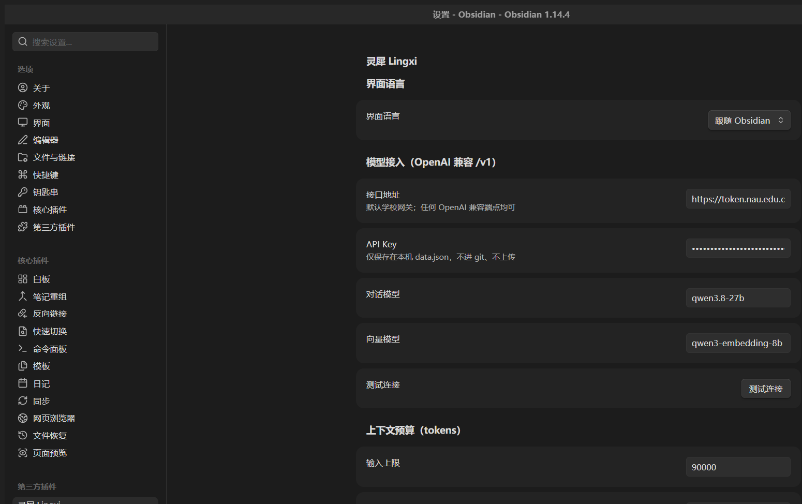

# 灵犀 Lingxi

**A bilingual (中文 / English) Qwen assistant that lives inside your Obsidian vault — understand, organize, and integrate your notes.**

> 双语 Qwen 笔记助手：用你自己的模型网关，理解、整理、整合你的整个知识库。
> 回答带引用角标，点击直达原文；整理只出建议（或在白名单文件夹内半自动写入），
> 永不静默修改你的笔记。



## What it does

Three tabs in one sidebar panel:

| Tab | Tools | Writes to your notes? |
|---|---|---|
| **Chat 对话** | Multi-session chat (new / switch / rename / delete, survives restarts; each session remembers its own context scope); vault-wide Q&A with `[1][2]` citation chips that jump to the source note and section; per-note anatomy (summary / key concepts / open questions); selection "Ask Lingxi" without leaving the note | No |
| **Organize 整理** | Related notes (similarity-scored, one-click `[[link]]`), semantic search (chunk-level hits), tag suggestions (prefers your existing tag vocabulary), near-duplicate detection | Tag suggestions only — auto inside whitelisted folders, one click to apply elsewhere |
| **Integrate 整合** | Compare 2–10 notes (consensus / divergence / complementary), merge notes into a structured draft with per-point sources, knowledge-gap analysis ("what is my vault missing to answer this?") | Only when you click "create note" |

All UI strings are fully bilingual — switch language in the sidebar header or in settings (it can also follow your Obsidian locale).

## Requirements

- Obsidian **1.12.7+** (desktop or mobile)
- Any **OpenAI-compatible** endpoint with a chat model and an embedding model.
  Defaults are pre-filled for a campus gateway (`qwen3.8-27b` chat + `qwen3-embedding-8b`
  embeddings) — change the base URL, models, and key in settings. Ollama, LM Studio,
  vLLM, DashScope-compatible mode, one-api/new-api gateways all work.

## Install

**Community plugin store:** search for `灵犀` or `Lingxi` after the submission is merged.

**Manual:** copy `main.js`, `manifest.json`, and `styles.css` into
`<your vault>/.obsidian/plugins/lingxi/`, then enable the plugin in
Settings → Community plugins.

**Beta via BRAT:** paste this repo URL into the BRAT plugin.

## First run

1. Settings → 灵犀 Lingxi → paste your API key (stored locally in `data.json`, never leaves your machine except to your endpoint).
2. Command palette → **Rebuild Lingxi index** (one-time; afterwards it syncs incrementally as you edit).
3. Open the sidebar (ribbon icon) → set context to **全库检索 / Whole vault** → ask away.

## Privacy

- Notes are sent **only** to the endpoint you configure — there is no third-party service, no telemetry, no account.
- The embedding index is cached locally in `.obsidian/plugins/lingxi/cache.json`.
- The plugin never edits notes silently: outside your whitelisted "auto-organize" folders every change is a suggestion you apply yourself.

## Development

```bash
npm install
npm run dev        # esbuild watch → main.js
npm run build      # tsc --noEmit + production bundle
npm test           # vitest (core logic, HTTP mocked — no network needed)
```

Architecture: `src/core/` is pure TypeScript with zero Obsidian imports (indexing, RAG, vector store, LLM/HTTP via injected transport, prompt builders/parsers) so it unit-tests in plain Node; `src/obsidian/` holds the Obsidian-facing glue (views, ports, settings).

## License

MIT © Zhe

---

## 中文说明

**灵犀 Lingxi** 是一个住在 Obsidian 侧边栏里的双语 Qwen 助手，分三个标签页：

- **对话**：多会话管理（新建/切换/重命名/删除，重启后恢复，每个会话记住自己的上下文范围）；
  全库问答，回答带 `[1][2]` 引用角标，点击直达来源笔记与段落；
  也可针对当前笔记做结构解剖，或对选中文字即问即答。
- **整理**：相关笔记（带相似度，一键插入双链）、语义搜索（按段落命中）、
  标签建议（优先复用你已有的标签）、近似重复检测。
- **整合**：多篇对比（共识/分歧/互补）、主题合并（生成带来源标注的草稿）、
  知识缺口分析。

**隐私**：笔记只会发送到你亲自配置的接口；无遥测、无账号；索引缓存在本库内。
**写入边界**：白名单文件夹外的任何改动都只是建议，点一下才写入 frontmatter。

**开发**：核心逻辑（`src/core/`）零 Obsidian 依赖，可在 Node 下单测；
配套开发文档（计划/决策/踩坑/测试记录）见仓库 `docs/` 目录。
