# 开发计划

## 阶段总览

```mermaid
gantt
    title 灵犀 Lingxi 开发阶段
    dateFormat X
    axisFormat %s
    section Phase1 骨架与链路
    骨架+设置+i18n          :p1a, 0, 1
    LLM 客户端(mock 测试)    :p1b, after p1a, 1
    侧边栏外壳+语言切换       :p1c, after p1a, 1
    section Phase2 理解
    索引引擎(分块/增量)      :p2a, after p1b, 1
    RAG 检索                :p2b, after p2a, 1
    带引用问答               :p2c, after p2b, 1
    section Phase3 整理
    相关笔记/语义搜索        :p3a, after p2b, 1
    标签建议                 :p3b, after p2a, 1
    MOC/重复检测            :p3c, after p3b, 1
    section Phase4 整合
    多篇对比/合并/缺口       :p4a, after p2c, 1
    section Phase5 验收
    临时库真机冒烟+截图      :p5a, after p3c, 1
```

## 各阶段验收标准

- **Phase 1**：`npm run build` 通过（tsc+esbuild）；`npm test` 通过（i18n 字典一致性、
  LLM 请求构造/响应解析/流式降级、settings 默认值）；mock 网关全链路测试通过；
  侧边栏能在 Obsidian 打开，语言切换即时生效。
- **Phase 2**：索引增量性有单测（改一个文件只重算该文件）；RAG 排序有单测；
  端到端：问一个问题，回答带可点击引用且引用段落确实是来源。
- **Phase 3**：标签建议命中率人工抽检 ≥ 记录在 03-测试记录.md；相关笔记列表
  与 Smart Connections 同类列表可比对。
- **Phase 4**：对比功能输出结构稳定（共识/分歧/互补三栏），人工评审通过。
- **Phase 5**：临时测试 vault（不用真实库）安装 main.js 成功加载，截图归档，
  无 console 报错；中英界面截图各一张。

## 当前进度

- [x] Phase 1（骨架+设置+i18n+LLM 客户端：32 单测通过、build 通过、首提交 80a65cb）
- [x] Phase 2（索引引擎+RAG+带引用问答：70 单测通过、build 通过）
- [ ] Phase 3（整理）
- [ ] Phase 4（整合）
- [x] Phase 5 部分（插件已装进哲真实库 D:\_Tools\Obsidian 并冷启动加载成功，
      设置面板截图验证；聊天面板实机截图等 key 就绪后补）
